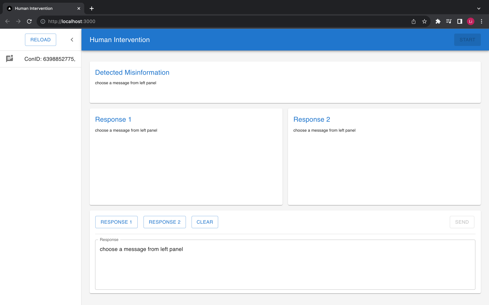

## Getting Started
Install all dependencies:

```bash
npm install
```

Then, run the development server:

```bash
npm run dev
# or
yarn dev
# or
pnpm dev
# or
bun dev
```

Open [http://localhost:3000](http://localhost:3000) with your browser to see the result.


## Development
- Framework: [React](https://react.dev/learn)
- State Management: [Redux](https://redux-toolkit.js.org/tutorials/quick-start) + [Immer](https://redux-toolkit.js.org/usage/immer-reducers)
- UI Design: [MUI](https://mui.com/material-ui/getting-started/)

You can start editing the page by modifying `app/page.tsx`. The page auto-updates as you edit the file.

